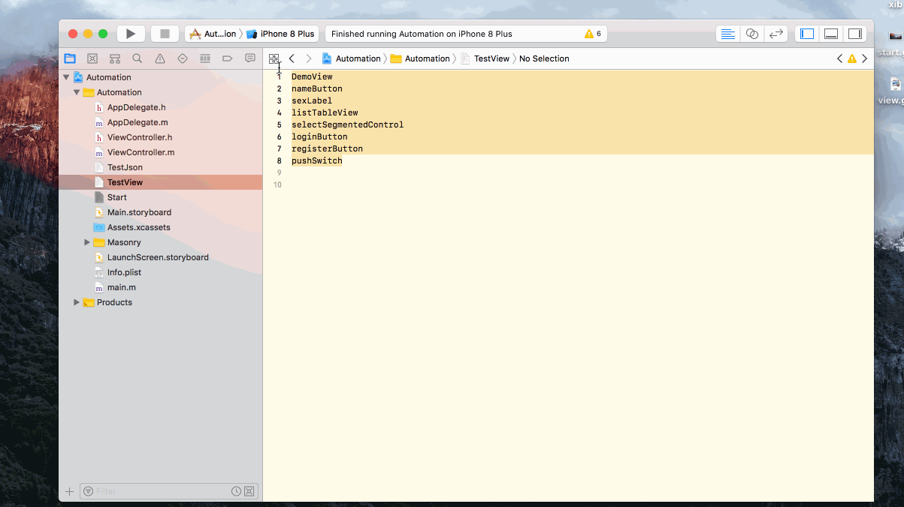
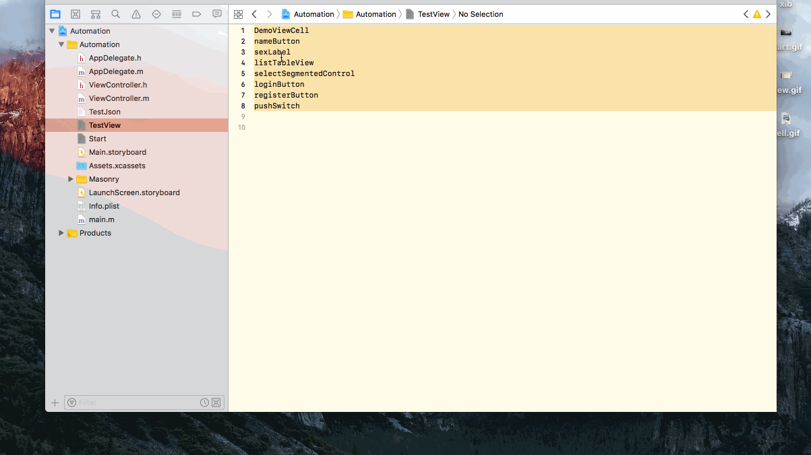
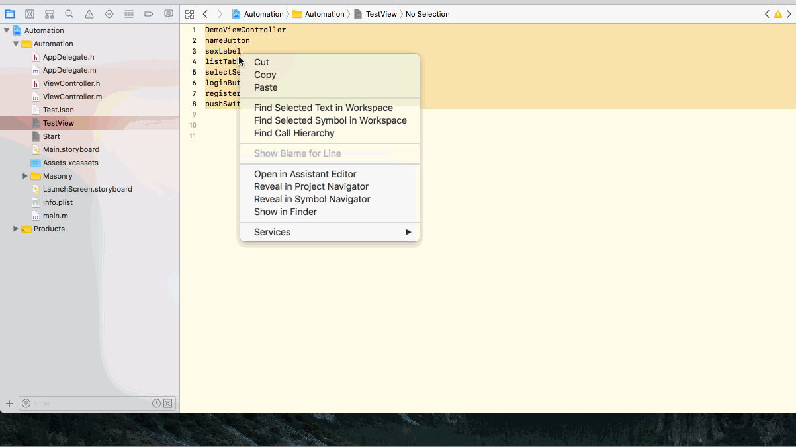
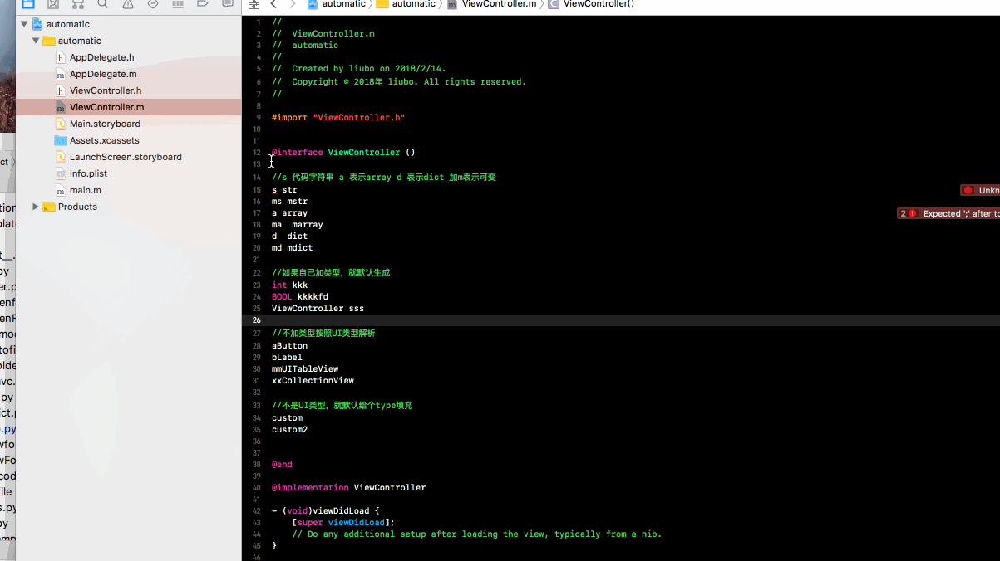
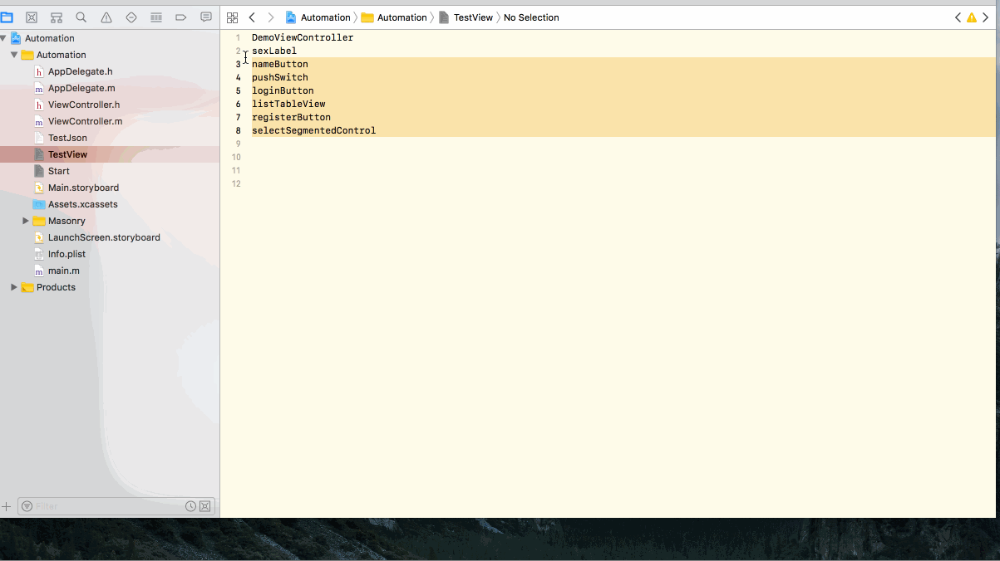
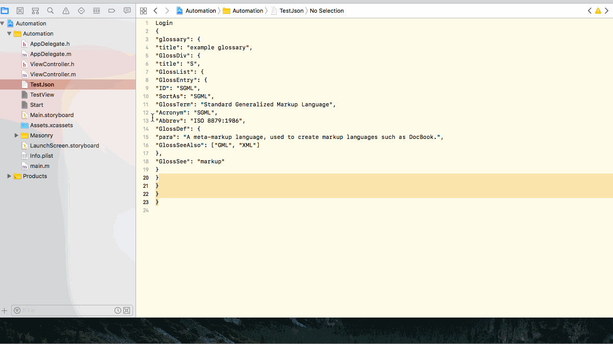
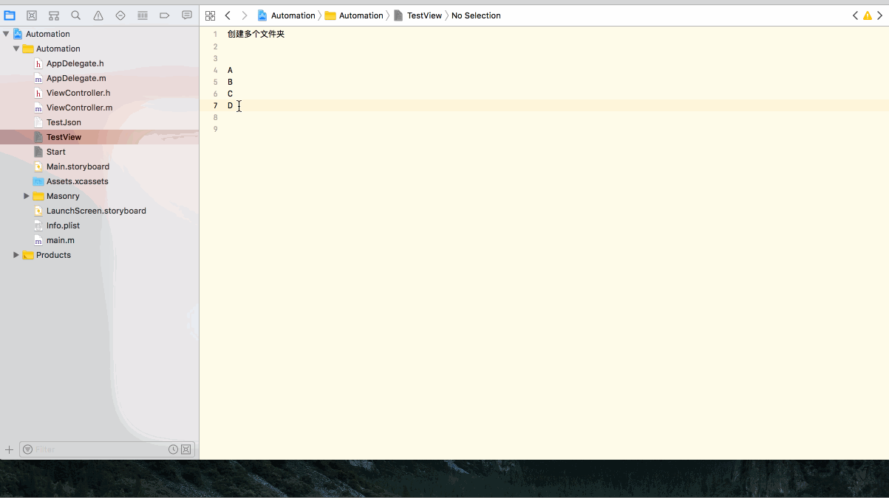

---
iOS代码自动化工具
---
一直以来都想都行写个自动化的工具，简化iOS开发，自动化脚本主要有以下几种方式：
``` bash
commandline
Xcode插件，苹果屏蔽了好多很好用的插件
图形化界面，做个图形化的界面点击生成代码
workflow，目前可以支持Python，Ruby，shell等，
```

## 项目地址
https://github.com/liubobo/automation.git

## 安装方式
``` bash
git clone https://github.com/liubobo/automation.git
cd automation/project && sudo python setup.py develop
点击安装Services下的workflow
```


## 本文主要教workflow这种方式，一图胜千言， Let's start!
``` bash
新建一个workflow，选择命令行，然后选你喜欢的语言，这里我选的是Python，
位于选项选Xcode,表示可以在Xcode右键执行代码
输出内容替换文本选项则是选的文字会被脚本输出代替，
服务收到选项 选文本表示可以获取文字内容，选文件夹，文件则可以获取文件路径
保存后系统会在 ~/Library/Services 路径下生成workflow
```


## 排序功能，会对多行文字按照长短来排序，可以排列头文件，或是排列的代码块


## animation_view 会根据xcode中第一行来生成View的类名，下面的几个按照UI控件的类型来各自生成相应的UI代码
命名的时候要规范，指定是Button或Label等


## animation_cell 会根据xcode中第一行来生成Cell的类名,下面生成模板代码


## animation_vc 会根据xcode中第一行来生成VC的类名,下面生成模板代码,事件，代理，方法等


## animation_prop 功能可以生成属性代码


## animation_getter 功能可以生成getter代码


## animation_hidden 功能可以生成隐藏文件或文件夹


## animation_mvc 功能可以根据文件夹批量生成文件夹mvc代码


## animation_json2model 功能可以根据json来生成相应的属性代码，LoginModel的实现文件里面有个默认模板
是根据自己的架构设计而来，需要修改的可以在templates目录改模板内容


## animation_mkfolders 批量创建文件夹


## animation_xib2file  可以把xib转化为代码文件，默认布局为masorny代码


